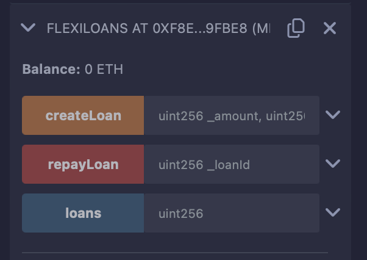

# FlexiLoans Smart Contract

This repository contains a Solidity smart contract for FlexiLoans, an innovative lending platform leveraging blockchain technology. The smart contract enables users to create and repay loans in a decentralized and secure manner.

## Problem

Traditional lending processes are often cumbersome, involving lengthy approval procedures, extensive collateral requirements, and reliance on third-party intermediaries. Moreover, access to loans may be limited due to geographical constraints or lack of established credit history. 

FlexiLoans aims to address these issues by providing a streamlined borrowing experience through blockchain technology. By utilizing smart contracts, FlexiLoans eliminates the need for intermediaries, reduces approval times, and enables borrowers to access loans quickly and conveniently.

## Features

- **Decentralized Borrowing**: Users can create loans directly on the blockchain without the need for intermediaries.
- **Flexible Loan Terms**: Borrowers can customize loan parameters such as loan amount, interest rate, and duration to suit their needs.
- **Collateralization**: Loans are secured by collateral, ensuring lender protection in case of default.
- **Transparent and Secure**: The use of blockchain technology ensures transparency, accountability, and security throughout the lending process.
- **Fast and Convenient**: Borrowers can access loans quickly, similar to ordering a service through a mobile app.

## How It Works

1. **Loan Creation**: Users initiate loans by specifying the loan amount, interest rate, duration, and collateral value.
2. **Loan Approval**: The loan details are stored on the blockchain, allowing lenders to review and approve loans.
3. **Loan Repayment**: Borrowers repay loans within the specified duration, with repayment amounts automatically transferred to lenders.
4. **Collateral Handling**: In the event of default, collateral assets are automatically transferred to lenders through smart contracts.

## Usage

The smart contract can be deployed on a compatible blockchain network such as Ethereum. Users can interact with the contract through transactions to create or repay loans.

## Deployment

To deploy the contract, compile the Solidity code using a compatible compiler (e.g., Solidity compiler) and deploy it to a blockchain network using a suitable deployment tool (e.g., Remix, Truffle).
Hereby,I am mentioning a screenshot of the deployment on the remix IDE.

## Contributors

- Maneesh Shukla
